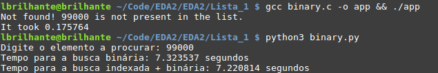

# Comparativo entre busca binária + Quicksort em python e C

* Para executar o arquivo .py utilize o comando "python3 binary.py"

* Para executar o arquivo .C compile com o comando "gcc binary.c -o app && ./app"

O resultado é abismal

